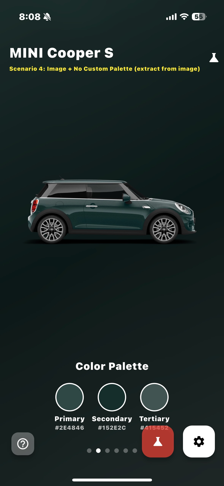
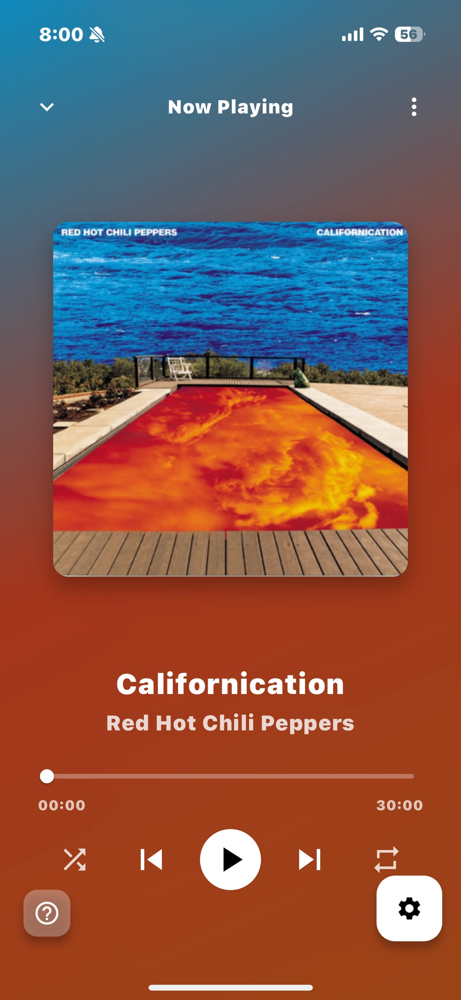
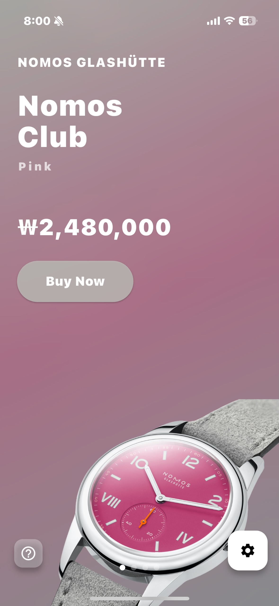
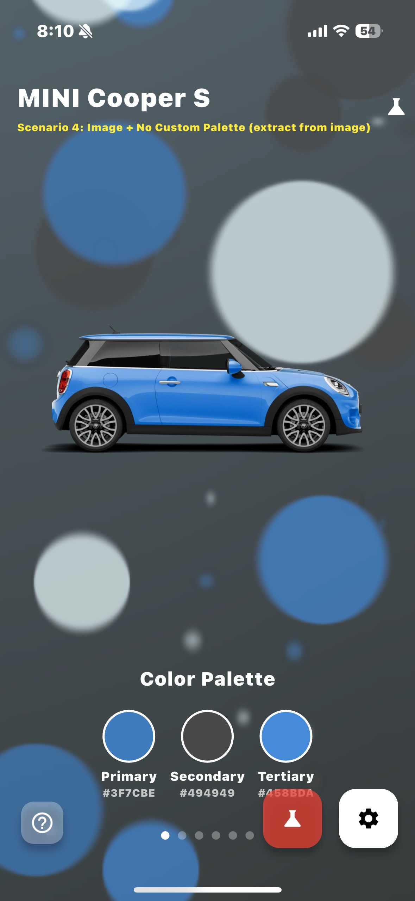
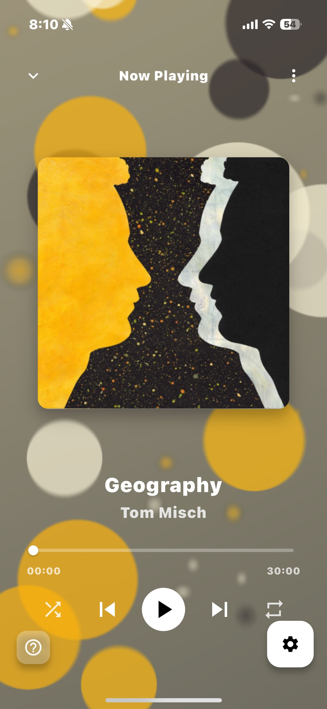
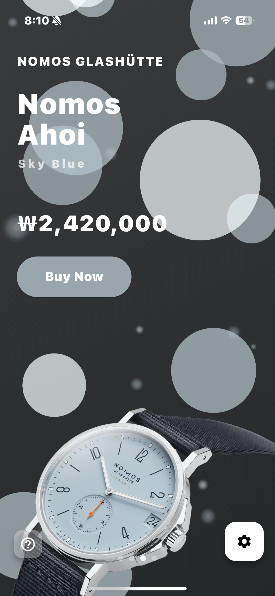
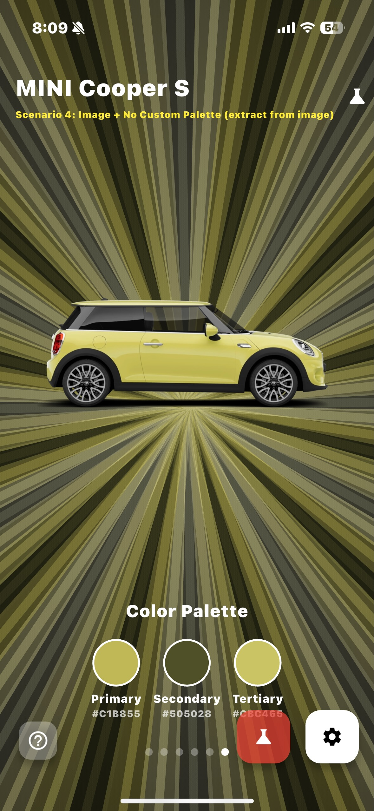
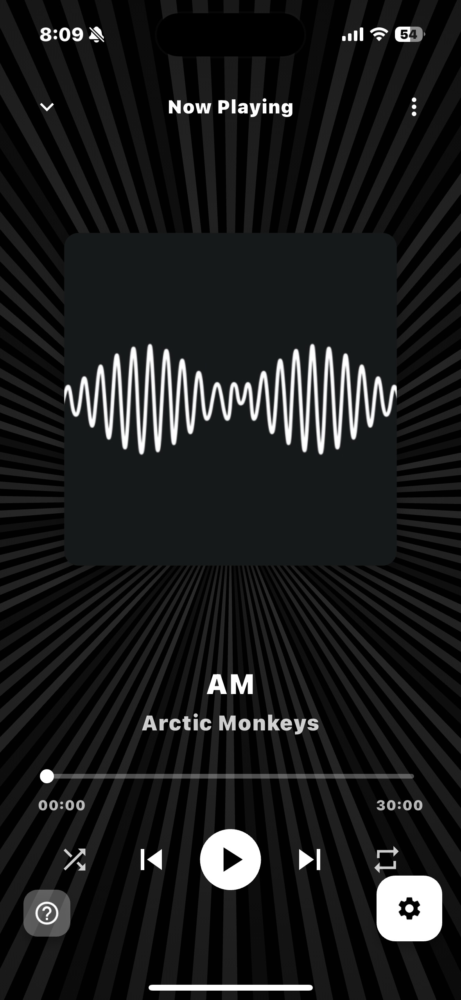
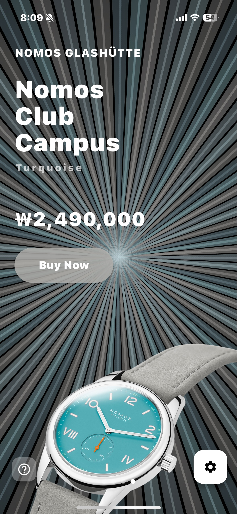

# Adaptive Aura

Adaptive Aura is a versatile Flutter package that creates beautiful, dynamic background effects that adapt to the colors of your images or custom color palettes. It provides an elegant container component that automatically extracts colors from images and applies visually striking aura effects, perfect for music players, image galleries, or any app that needs a touch of visual elegance.

## Features
 - Automatic color extraction from images to create harmonious visual effects
 - Three distinct aura styles: Gradient, Blob, and Sunray
 - Customizable parameters for animation speed, blur intensity, variety, and more
 - Smooth transitions between different images and color palettes
 - Highly optimized for performance with minimal impact on UI responsiveness

# Styles
## Gradient Style
A soft, flowing gradient effect inspired by Apple Music's design language, creating a subtle yet captivating background.

## Blob Style
Organic, fluid blob animations that react to user interaction and create a lively, playful background.

## Sunray Style
Dynamic, radial light rays that emanate from the center, creating a vibrant and energetic visual experience.

# Getting Started
Add this to your package's pubspec.yaml file:

~~~
dependencies:
  adaptive_aura: ^0.0.1
~~~

# Usage
## Basic Usage

~~~dart
AdaptiveAuraContainer(
  image: AssetImage('assets/images/album.jpg'),
  auraStyle: AuraStyle.blob,
  child: YourContentWidget(),
)
~~~

## Advanced Usage

~~~dart
AdaptiveAuraContainer(
  image: AssetImage('assets/images/album.jpg'), // When image is provided, colors are extracted from it and applied to the aura
  auraStyle: AuraStyle.gradient, // Select aura style (gradient, blob, sunray)
  variety: 0.7, // Adjusts the diversity of aura layers. For gradients, this makes the color spread more extensive
  colorIntensity: 0.8, // Controls how vibrant and opaque the colors appear in the effect
  blurStrength: 15.0, // Sets the blur intensity for a softer look
  blurLayerOpacity: 0.1, // Controls the opacity of the blur overlay for additional depth
  animationValue: 0.8, // Controls the animation intensity/strength (0.0-1.0)
  animationDuration: Duration(milliseconds: 800), // How long animations take to complete
  colorTransitionDuration: Duration(milliseconds: 300), // How long color transitions take when changing images
  onPaletteGenerated: (palette) {
    // Do something with the extracted palette
    print('Primary color: ${palette.primary}');
  },
  child: YourContentWidget(),
)
~~~ 

# Example App
The package includes a comprehensive example app that demonstrates all features and allows you to experiment with different parameters in real-time. The example app features a control panel that lets you adjust:
Animation intensity
Effect complexity (variety)
Aura style (Blob, Gradient, Sunray)
Blur settings (strength and opacity)
And more!
You can explore how the different parameters affect the visual appearance and find the perfect configuration for your app.

~~~dart
// Example of showing the control panel in the example app
void _showControlPanel() {
  showModalBottomSheet(
    context: context,
    isScrollControlled: true,
    backgroundColor: Colors.black87,
    shape: const RoundedRectangleBorder(
      borderRadius: BorderRadius.vertical(top: Radius.circular(20)),
    ),
    builder: (context) {
      return ControlPanel(
        animationValue: _animationValue,
        auraStyle: _auraStyle,
        variety: _variety,
        // Other parameters...
        onAnimationValueChanged: (value) {
          setState(() {
            _animationValue = value;
          });
        },
        // Other callbacks...
      );
    },
  );
}
~~~

# Parameters
## Key Parameters

| Parameter | Type | Description |
|-----------|------|-------------|
| image | ImageProvider? | The image to extract colors from. If null, a default palette or custom palette will be used. |
| colorPalette | AuraColorPalette? | Optional custom color palette. When provided, color extraction from the image is skipped. |
| auraStyle | AuraStyle | The style of aura effect to display. Options: AuraStyle.blob, AuraStyle.gradient, AuraStyle.sunray. |
| animationValue | double | Controls the intensity of the effect (0.0 to 1.0). |
| variety | double | Controls the complexity of the effect (0.0 to 1.0). Higher values generate more elements and complex effects. |
| blurStrength | double? | Uniform blur strength applied to the effect. |
| blurStrengthX & blurStrengthY | double? | Independent control of horizontal and vertical blur. |
| colorIntensity | double | Controls the opacity/intensity of the colors (0.0 to 1.0). |
| blurLayerOpacity | double? | Controls the opacity of the blur overlay layer. |
| onPaletteGenerated | Function? | Callback when a color palette is generated or changed. |

# Color Extraction
The package uses a sophisticated color extraction algorithm to analyze your images and create harmonious color palettes:
Sampling: Rather than analyzing every pixel (which would be inefficient), the algorithm samples a representative subset of pixels.
Brightness Sorting: The sampled colors are sorted by brightness to identify the lightest and darkest tones in the image.
Palette Creation: A balanced palette is created by selecting key colors:
Primary: A dominant mid-tone color
Secondary & Tertiary: Supporting colors that complement the primary
Light & Dark: The brightest and darkest tones for contrast
Fallback Mechanism: If color extraction fails or no colors are found, the system falls back to a default palette.

~~~dart
// Example of the color extraction process
final palette = await ColorExtractor.extractColorsFromImage(
  imageProvider: imageProvider,
  enableLogging: true,
);

// The resulting palette contains:
// - palette.primary: Main color
// - palette.secondary: Complementary color
// - palette.tertiary: Accent color
// - palette.light: Brightest color
// - palette.dark: Darkest color
~~~

You can also create custom palettes manually:
~~~dart
final customPalette = AuraColorPalette(
  primary: Colors.blue,
  secondary: Colors.purple,
  tertiary: Colors.cyan,
  light: Colors.white,
  dark: Colors.black,
);

// Or from a single color:
final derivedPalette = AuraColorPalette.fromColor(Colors.red);
~~~

# License
This project is licensed under the MIT License - see the LICENSE file for details.