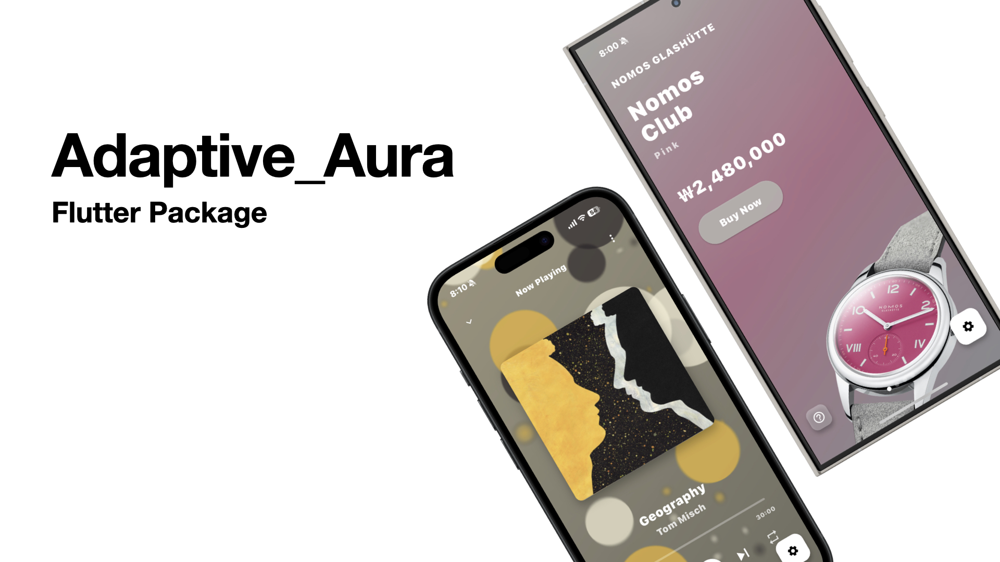

# Adaptive Aura

Adaptive Aura is a versatile Flutter package that creates beautiful, dynamic background effects that adapt to the colors of your images or custom color palettes. It provides an elegant container component that automatically extracts colors from images and applies visually striking aura effects, perfect for music players, image galleries, or any app that needs a touch of visual elegance.

## Features
 - Automatic color extraction from images to create harmonious visual effects
 - Three distinct aura styles: Gradient, Blob, and Sunray
 - Customizable parameters for animation speed, blur intensity, variety, and more
 - Smooth transitions between different images and color palettes
 - Highly optimized for performance with minimal impact on UI responsiveness

# Styles
## Gradient Style
A soft, flowing gradient effect inspired by Apple Music's design language, creating a subtle yet captivating background.

## Blob Style
Organic, fluid blob animations that react to user interaction and create a lively, playful background.

## Sunray Style
Dynamic, radial light rays that emanate from the center, creating a vibrant and energetic visual experience.

# Getting Started
Add this to your package's pubspec.yaml file:

~~~
dependencies:
  adaptive_aura: ^0.0.1
~~~